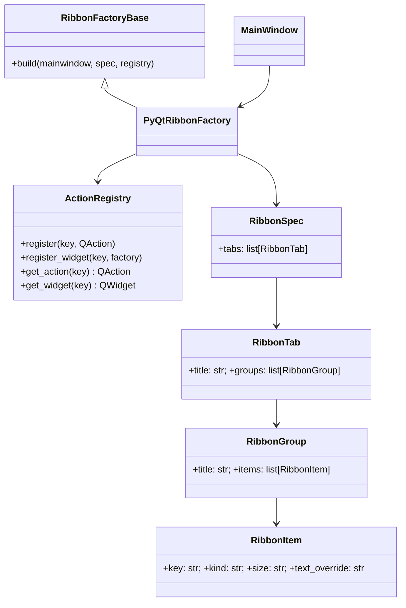

# Ribbon Architecture

```mermaid
classDiagram
    class MainWindow
    class ActionRegistry {
      +register(key, QAction)
      +register_widget(key, factory)
      +get_action(key) QAction
      +get_widget(key) QWidget
    }
    class RibbonSpec { +tabs: list[RibbonTab] }
    class RibbonTab { +title: str; +groups: list[RibbonGroup] }
    class RibbonGroup { +title: str; +items: list[RibbonItem] }
    class RibbonItem { +key: str; +kind: str; +size: str; +text_override: str }
    class RibbonFactoryBase { +build(mainwindow, spec, registry) }
    class PyQtRibbonFactory

    RibbonFactoryBase <|-- PyQtRibbonFactory
    MainWindow --> PyQtRibbonFactory
    PyQtRibbonFactory --> RibbonSpec
    PyQtRibbonFactory --> ActionRegistry
    RibbonSpec --> RibbonTab
    RibbonTab --> RibbonGroup
    RibbonGroup --> RibbonItem
```
